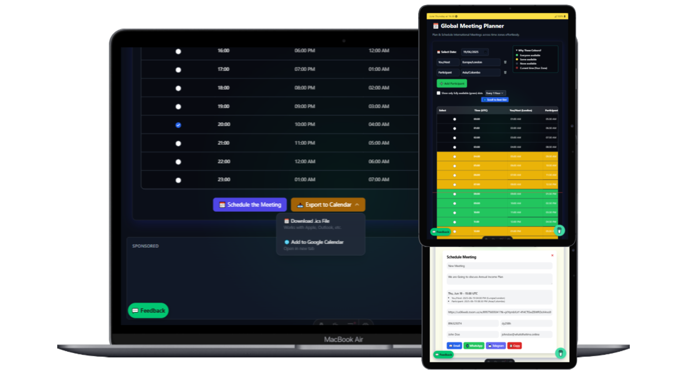
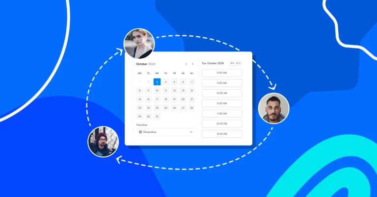

In 2025, remote work is no longer the future — it’s the norm. But with that freedom comes one of the trickiest productivity puzzles: time zones. You may be starting your workday just as your teammates are signing off. This makes coordination harder, meetings more complex, and productivity harder to maintain.

So how do the best global teams overcome this?

We’ve curated 10 field-tested, expert-backed productivity hacks to help remote teams not just survive, but thrive — across time zones, devices, and cultures.

---

## 1. Default to Asynchronous Communication

Instead of expecting real-time replies, encourage your team to:

- Leave clear updates in tools like Notion or Slack.
- Record quick videos using Loom.
- Use threaded discussions instead of constant Zooms.

This gives everyone time to digest and respond during their natural work hours.

---

---

## 2. Use a Shared World Clock Dashboard

Avoid mental math forever. Tools like [What’s The Time](https://whatsthetime.online), WorldTimeBuddy, or Timezone.io let teams create shared dashboards showing key cities.

This way, everyone is aware of teammates' current local times.

---

## 3. Establish “Core Hours”

If your team spans 4–10 hour differences, set overlap hours (e.g., 2 hours/day where everyone is online).

Use this time for urgent decisions or meetings. Outside of it, let async work flourish.

---
<!-- disabled

<ins class="adsbygoogle"
     style="display:block; text-align:center;"
     data-ad-layout="in-article"
     data-ad-format="fluid"
     data-ad-client="ca-pub-6381695271630022"
     data-ad-slot="2167329849"></ins>

 -->

---

## 4. Automate Meeting Scheduling Across Time Zones

Using a global meeting planner that considers everyone’s working hours is a game-changer.

Try tools like:

- [What’s The Time Global Meeting Planner](https://whatsthetime.online/meeting-planner)
- Calendly with time zone detection
- Reclaim AI for auto-scheduling

Never again suggest a time that’s 2 AM for someone.

---

---

## 5. Batch Communication and Status Updates

Instead of constant pings, encourage structured updates:

- End-of-day reports
- Weekly video standups
- Trello or Asana summaries

This builds clarity without interrupting focus time.

---

## 6. Design Workflows with Time in Mind

Use tools like:

- ClickUp or Notion for async task tracking
- GitHub Issues or Jira for engineering
- Google Docs for collaborative writing with comments

Decentralize decision-making to remove blockers when managers are offline.

---

## 7. Rotate Meeting Times Fairly

Always having meetings at 9 AM Eastern? That’s 7:30 PM in India.

Create a rotation system so different teams share the inconvenience across time zones.

Use spreadsheets or meeting tools that auto-rotate based on participants.

---

---

## 8. Respect Boundaries (No Late-Night Pings!)

If someone works from Tokyo, don’t expect them to reply at 3 AM.

Use tools like:

- Slack’s "Do Not Disturb" mode
- Google Calendar’s "Working Hours"
- Email scheduling to send messages during active times

Remote teams thrive when boundaries are clear and respected.

---

## 9. Record Everything

Can’t attend a meeting? No problem.

- Record Zoom/Google Meet calls
- Share notes with Otter.ai or Fireflies
- Post TL;DRs in Slack after meetings

This creates a self-updating knowledge base and reduces the fear of missing out (FOMO).

---
<!-- disabled

<ins class="adsbygoogle"
     style="display:block; text-align:center;"
     data-ad-layout="in-article"
     data-ad-format="fluid"
     data-ad-client="ca-pub-6381695271630022"
     data-ad-slot="2167329849"></ins>

 -->
---

## 10. Celebrate Culture and Flexibility

Different time zones also mean different cultures. Embrace it!

- Share local holidays in a shared calendar
- Encourage team “culture shares” in monthly newsletters
- Allow flexible hours for personal needs

This boosts belonging and prevents remote workers from feeling like outsiders.

---

---

## Final Thoughts

Productivity in remote teams is no longer about clocking in. It’s about coordination, clarity, and compassion.

Time zones can be frustrating, but with the right tools and mindset, they become a strength — not a blocker.

📌 If your team is struggling to plan meetings or track time zones, try our [Global Meeting Planner](https://whatsthetime.online/meeting-planner). It’s built for this exact challenge — fast, mobile-friendly, and made for humans, not spreadsheets.

The future of work is asynchronous, inclusive, and global. Let’s make it productive too.

📤
28/06/2025
