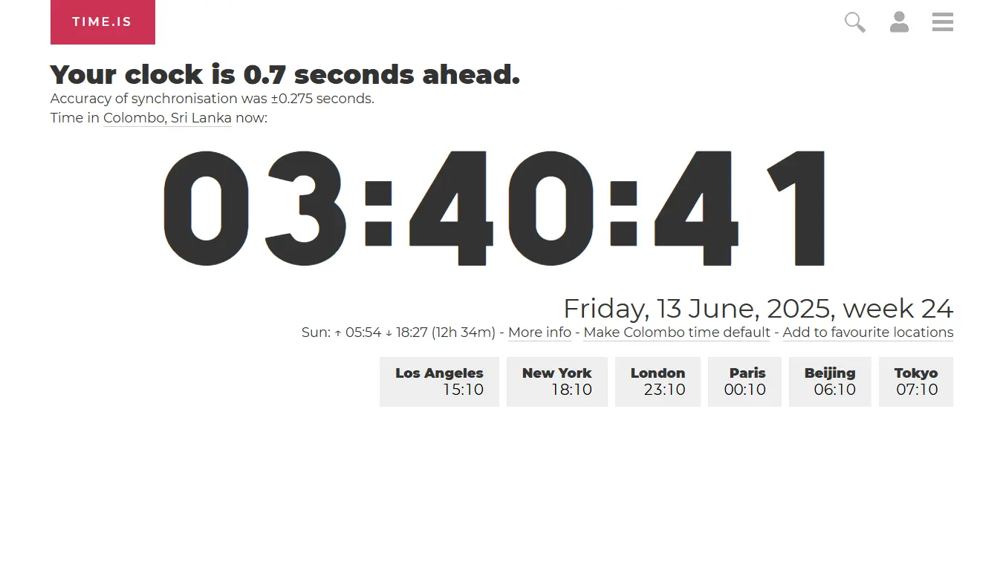

Time zone headaches are a familiar pain, aren't they? Especially now in 2025, with more of us working remotely, collaborating with global teams, and connecting with people across continents. It can feel like you need a PhD just to figure out if you're calling your colleague in London at a reasonable hour or waking them up in the middle of the night!

That's why having a reliable and easy-to-use time converting tool in your digital toolkit is essential. We've scoured the web and put the top contenders through their paces to bring you our ultimate guide to the **7 best time converting tools you can rely on in 2025**. We've looked at everything from speed and ease of use to unique features and overall user experience, all with a human touch to help you find the perfect fit for your needs.

## 🥇 1. <a href="https://whatsthetime.online" target="_blank" rel="noopener noreferrer">What's The Time</a> – The Modern Time Wizard

**Why we're calling it magic:**

Imagine a time converter that just *gets* it. <a href="https://whatsthetime.online" target="_blank" rel="noopener noreferrer">What's The Time</a> feels like it was built specifically for the way we live and work today. It instantly detects your current time zone (pretty neat, right?), and the dynamic weather and cute emoji cards add a little spark to your day. The clock-style picker with smart auto-suggestions makes finding the time in another location a breeze – no more endless scrolling through lists! Plus, it's super fast on your phone and those shareable links for scheduling and finding the best time to meet? Game-changers. You can even compare multiple time zones side-by-side in a clean, intuitive view. It's the kind of tool that makes you wonder how you ever managed without it.

> **Perfect for:** Digital nomads juggling multiple time zones, remote workers collaborating globally, and anyone who appreciates a beautifully designed and efficient productivity tool.

🚀 Crafted by developers who clearly have an eye on the future, using <a href="https://whatsthetime.online" target="_blank" rel="noopener noreferrer">What's The Time</a> is genuinely a delightful experience.

**Pros:**

* 🌍 **Real-time zone detection:** Automatically figures out where you are.
* 🌤️ **Dynamic weather & emoji cards:** Adds a fun and informative touch.
* 🌓 **Dark and Light theme included.** 
* ⏰ **Intuitive clock picker with auto-suggestions:** Makes time selection quick and easy.
* 📱 **Mobile-first and lightning-fast:** Works seamlessly on any device.
* 🔗 **Shareable links, best time to meet feature, and comparisons:** Super useful for collaboration.
* ✨ **Clean and modern user interface:** A joy to look at and use.

**Cons:**

* Relatively newer compared to some older tools, so it might be missing some niche historical data (though it's constantly improving!).
* The focus is heavily on current time, so deep historical analysis isn't its primary strength.

## 🥈 2. <a href="https://www.timeanddate.com/" target="_blank" rel="noopener noreferrer">TimeAndDate.com</a> – The Veteran with Vast Knowledge

Still a powerhouse in the time zone world, <a href="https://www.timeanddate.com/" target="_blank" rel="noopener noreferrer">TimeAndDate.com</a> remains an incredibly detailed resource.

**What it brings to the table:**

If you need to dive deep into the intricacies of time zones, look no further. <a href="https://www.timeanddate.com/" target="_blank" rel="noopener noreferrer">TimeAndDate.com</a> is like the encyclopedia of time. It’s fantastic for planning events across different time zones, looking up historical time changes, and understanding the nuances of daylight saving time in various regions. It's a real workhorse for enterprise users who need comprehensive data and scheduling features.

> **Great for:** Complex scheduling, in-depth time zone lookups, and accessing a wealth of historical time data.

🧱 **But:** Let's be honest, in the sleek and modern landscape of 2025, the user interface feels a tad old-school. Navigating through the sheer amount of information can sometimes feel a bit overwhelming if you just need a quick conversion.

**Pros:**

* 📅 **Comprehensive event scheduling tools:** Excellent for organizing meetings with participants in different time zones.
* 🕰️ **Extensive historical data:** A treasure trove of information on past time changes.
* ⚙️ **Detailed information on DST:** Provides thorough details about daylight saving time rules worldwide.
* 🏢 **Suitable for enterprise use cases:** Offers robust features for business and organizational needs.

**Cons:**

* 👴 **Dated user interface:** The design can feel cluttered and less intuitive compared to newer tools.
* 🤯 **Can be overwhelming for simple conversions:** The sheer volume of information might be too much for basic time lookups.

## 🥉 3. <a href="https://www.worldtimebuddy.com/" target="_blank" rel="noopener noreferrer">WorldTimeBuddy</a> – The Visual Planner

**Why it's still a solid choice:**

For those who think visually, <a href="https://www.worldtimebuddy.com/" target="_blank" rel="noopener noreferrer">WorldTimeBuddy</a> offers a really user-friendly experience, especially when it comes to planning across multiple time zones. The side-by-side timeline view is excellent for seeing at a glance when everyone will be available.

**The lowdown:**

The visual timeline is definitely the standout feature here, making it super easy to coordinate schedules for meetings or collaborative work. However, the trend in 2025 seems to be shifting towards subscription models, and unfortunately, some of the more helpful features in <a href="https://www.worldtimebuddy.com/" target="_blank" rel="noopener noreferrer">WorldTimeBuddy</a> are now locked behind a paywall, which might be a drawback for casual users.

**Pros:**

* 📊 **Excellent visual timeline:** Makes it easy to see overlapping work hours across different time zones.
* 🤝 **User-friendly for comparing multiple locations:** Simple to add and manage several time zones.

**Cons:**

* 🔒 **Limited free features:** Many useful functionalities now require a subscription.

## 💡 4. <a href="https://fliggy.com/" target="_blank" rel="noopener noreferrer">Fliggy</a> – The Smart Natural Language Converter

**What makes it so clever:**

<a href="https://fliggy.com/" target="_blank" rel="noopener noreferrer">Fliggy</a> takes a completely different approach that feels incredibly futuristic and human. Instead of making you pick cities from a dropdown, you just type what you're thinking in plain English. For example, you can type "9am in New York to London" or "noon tomorrow in SF for my colleague in Berlin," and it instantly gives you the answer. It's like having a conversation with your time converter.

**The magic behind it:**

This tool is perfect for those quick, one-off conversions you need to do multiple times a day. It removes all the friction of clicking through menus, making it one of the fastest ways to get a specific answer. It's the "search bar" for time zones, and once you get used to it, it's hard to go back.

**Pros:**

* 🗣️ **Natural language input:** Just type your query like you would ask a person.
* ⚡ **Extremely fast for specific queries:** Ideal for quick, direct conversions without extra clicks.
* ✨ **Minimalist and focused UI:** No distractions, just a search bar and your answer.
* 🔗 **Shareable links:** Easily share the conversion result with others.

**Cons:**

* 📊 **Not ideal for visual planning:** Lacks the side-by-side timeline view for finding meeting slots.
* 🧑‍🤝‍🧑 **No team features:** It’s built for individual use, not for managing a team's time zones.

## 🎨 5. <a href="https://everytimezone.com/" target="_blank" rel="noopener noreferrer">Every Time Zone</a> – The Elegant Slider

**What makes it stand out:**

<a href="https://everytimezone.com/" target="_blank" rel="noopener noreferrer">Every Time Zone</a> is all about elegant simplicity. Its core feature is a visual slider that lets you drag a marker across your own timeline and instantly see the corresponding time in major time zones around the world. It’s beautifully designed and incredibly intuitive for getting a quick, high-level view of global times.

**The experience:**

There are no complex menus or inputs here. You just land on the page and slide. The color-coding for day, evening, and night makes it immediately obvious when it's a good time to connect. It's the perfect tool for when you think, "I wonder what time it is for everyone else *right now*?"

**Pros:**

* slider **Highly intuitive visual slider:** An effortless way to see time across the globe.
* ✨ **Beautiful, clean interface:** A minimalist design that's a pleasure to use.
* 👀 **At-a-glance visualization:** Quickly find overlapping business hours without any setup.

**Cons:**

* ⚙️ **Lacks advanced features:** No detailed event scheduling, historical data, or shareable meeting links.
* 📍 **Limited location customization:** Focuses on major time zones rather than specific cities.

## ⚡ 6. <a href="https://time.is/" target="_blank" rel="noopener noreferrer">Time.is</a> – The Accuracy Specialist

**Why you can trust it:**

<a href="https://time.is/" target="_blank" rel="noopener noreferrer">Time.is</a> has one primary mission: to show you the exact, correct time. It synchronizes with atomic clocks, making it one of the most accurate time sources on the web. While its homepage is a world clock, its "The Time Zone Converter" feature is a hidden gem for purists who value speed and precision above all else.

**The no-frills approach:**

This tool is blazingly fast and completely uncluttered. You input your locations and the time, and it gives you the answer instantly. There are no fancy graphics or extra features to slow it down. It’s a professional-grade tool for when you need the right answer, right away.

**Pros:**

* ⚛️ **Known for extreme accuracy:** Synchronized with atomic clocks for reliable time.
* 🚀 **Incredibly fast and lightweight:** No bloat, just pure function.
* minimalist **Clean, distraction-free interface:** Does one job and does it perfectly.

**Cons:**

* barebones **Very basic functionality:** Lacks visual planning tools or multi-person scheduling features.
* less-discoverable **Converter is a feature, not the main page:** You need to navigate to the specific converter page.

## 🤝 7. <a href="https://savvytime.com/" target="_blank" rel="noopener noreferrer">Savvy Time</a> – The Team Collaborator

**How it helps teams:**

<a href="https://savvytime.com/" target="_blank" rel="noopener noreferrer">Savvy Time</a> is built from the ground up for teams spread across the globe. More than just a converter, it acts as a shared dashboard for your entire team. Each member can be added, and you get a clean, visual overview of where and when everyone is. It makes you feel more connected to your remote colleagues.

**The collaborative edge:**

It excels at scheduling by allowing you to create and share a team directory, making it easy to see who's online, who's in their evening, and who's asleep. The event scheduler is integrated directly into this team view, streamlining the process of finding that perfect meeting slot that works for everyone.

**Pros:**

* 🧑‍🤝‍🧑 **Designed for team collaboration:** Create a directory of your team members' time zones.
* 🗓️ **Integrated team scheduling:** Easily find and share meeting times that work for the whole team.
* 🗺️ **Clear visual layout:** See your team's availability on a single, easy-to-read page.

**Cons:**

* overkill **Might be too much for individual use:** Its main benefits shine in a team context.
* 💰 **Free plan has limitations:** Advanced features and larger teams require a paid subscription.

## 📌 Conclusion

In the ever-evolving landscape of 2025, having a reliable time converting tool is no longer a luxury – it's a necessity. While veterans like TimeAndDate.com offer incredible depth and visual tools like WorldTimeBuddy and Every Time Zone make planning intuitive, they each serve specific needs.

However, if you're looking for one tool that does it all—blending speed, beautiful design, intuitive features, and powerful sharing capabilities—then **What's The Time** (<a href="https://whatsthetime.online" target="_blank" rel="noopener noreferrer">https://whatsthetime.online</a>) remains the clear winner. Its focus on user experience, combined with its innovative feature set, makes it a joy to use every single time you need to bridge the time zone gap.

---

Want to stay ahead of the curve with more productivity tips and tool reviews? Make sure to follow our blog! Or, if you're a developer interested in building innovative web tools, we'd love to connect.