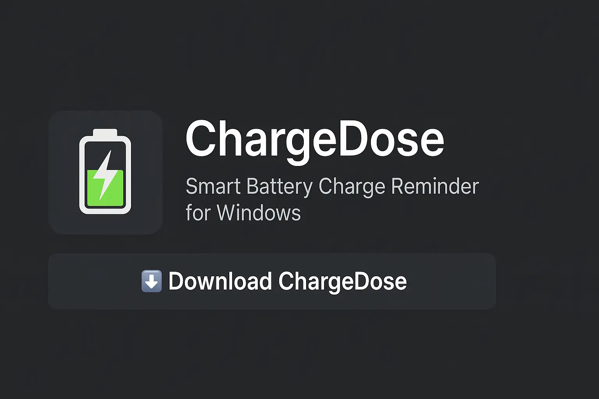

**Tired of forgetting when to unplug your laptop? Worried about damaging your battery over time?**  
Introducing **ChargeDose**, a mindful battery care tool built by the team behind [What’s The Time](https://whatsthetime.online).

With the launch of **ChargeDose v2.0**, we're expanding from timezones into your laptop's **lifespan** — quite literally.

## 💡 Why ChargeDose Exists

Laptop batteries wear out faster due to overcharging or deep draining. Many users unknowingly keep their chargers plugged in 24/7 — damaging lithium-ion cells and reducing capacity permanently.

While some high-end laptops offer built-in charge limits, most users don’t get that feature. That’s where ChargeDose comes in:

> “ChargeDose is like a friend who gently taps your shoulder when it’s time to unplug or plug in the charger.”

---

## ⚙️ How ChargeDose Works

Once installed, ChargeDose runs quietly in your system tray. It checks your battery percentage and power status every few seconds and intelligently reminds you when:

- Your battery **exceeds 80%** while charging (time to unplug)
- Your battery **drops below 20%** while on battery (time to plug in)

No heavy GUI, no system bloat — just a minimal, respectful assistant for battery care.

<!-- AdSense Ad Slot 1 -->
<ins class="adsbygoogle"
     style="display:block; text-align:center;"
     data-ad-layout="in-article"
     data-ad-format="fluid"
     data-ad-client="ca-pub-6381695271630022"
     data-ad-slot="2167329843"></ins>

---

## ✨ What's New in Version 2.0

ChargeDose v1.0 was released as a quick AHK-based experiment. But now, v2.0 is fully rebuilt and refined:

- ✅ New dark-themed **landing page** → [chargedose.whatsthetime.online](https://chargedose.whatsthetime.online)
- ✅ Clean `.exe` installer with auto-start
- ✅ System tray icon + lightweight
- ✅ Built for **Windows 10/11**
- ✅ Developed with love by Infinity Minds (Creators of whatsthetime.online)

---

## 🔽 How to Download

We’ve made downloading super easy:

👉 Visit **[chargedose.whatsthetime.online](https://chargedose.whatsthetime.online)**  
Click the **"Download ChargeDose"** button — and install it in seconds.

No ads. No spyware. Just mindful tech.

---

## 🧠 Designed by Thinkers, for Thinkers

At Infinity Minds, we’re not just building tools. We’re building *daily mindfulness companions* that guide people gently, not addict them.

ChargeDose is a tiny step in that direction — a product designed for **meaningful interaction**, not dopamine spikes.

Like our vision for [Remein](https://whatsthetime.online/comingsoon), ChargeDose brings value through:

- ⚖️ Balance: plug/unplug only when needed  
- ⚙️ Simplicity: no clunky UIs  
- 🤝 Trust: 100% offline, no background data mining  

---

## 🌐 A Product From the What's The Time Universe

If you've been using our tools like:

- 🌍 [Time Converter](/)
- 📅 [Meeting Planner](/meeting-planner)

Then you already know we focus on speed, clarity, and clean UX. ChargeDose brings that same attention to detail to a new domain: **battery health**.

ChargeDose fits in our growing family of purpose-driven digital tools.

<!-- AdSense Ad Slot 2 -->
<ins class="adsbygoogle"
     style="display:block; text-align:center;"
     data-ad-layout="in-article"
     data-ad-format="fluid"
     data-ad-client="ca-pub-6381695271630022"
     data-ad-slot="2167329843"></ins>

---

## 🔮 What’s Next for ChargeDose?

We’re just getting started. Here’s what the roadmap looks like:

- ☁️ **Cloud Sync** for user preferences (optional)
- ⌨️ **Custom thresholds** for power users
- 🔔 Smarter notifications (time-based, sleep-aware)
- 🧪 MacOS/Linux versions (experimental)
- 🧰 Add it to [InfinityMinds.online](https://whatsthetime.online/comingsoon) in the future

---

## 📣 Help Us Spread the Word

If you find ChargeDose useful:

- ⭐ Star us on GitHub  
- 💬 Share the download link with friends  
- 🐞 Report bugs or ideas in our GitHub issues  

> We're building this for laptop lovers — minimalists who want more *life* out of their battery, not just more screen time.

---

## 📎 Final Thoughts

ChargeDose isn’t a power manager — it’s a **gentle philosophy**:  
> _“Charge when needed. Unplug with intention.”_

That’s the mindset we want to spread.  
Just like **What’s The Time** helps you plan across zones, **ChargeDose** helps your machine breathe.

👉 [Download ChargeDose now](https://chargedose.whatsthetime.online)  
and give your battery a second life.

---

*Built by dreamers at Infinity Minds. Crafted in Sri Lanka 🇱🇰.*
