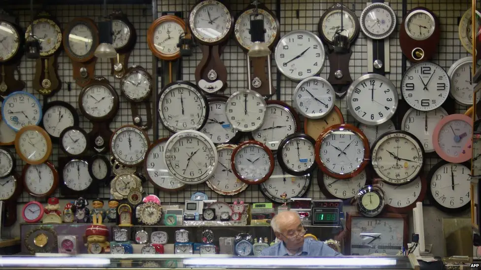

Ever sent a meeting invitation for **3 PM**, only to have half your team show up three hours early and the other half three hours late? 🤦‍♀️ If you've ever worked with people across the country or around the world, you've likely felt the headache of navigating the complex web of time zones.

But have you ever stopped to wonder **how we ended up with this system in the first place**? And in an age of instant global connection, is it still the best way to keep time?

Let’s take a journey through the past, present, and future of time conversion!

---

## 🚂 A Brief History of Time (Zones)

Believe it or not, before the late 19th century, **most towns and cities set their own time** based on the sun's position. This meant that two towns just a few miles apart could have slightly different times. It was chaotic, to say the least—especially with the rise of railroads.

> Imagine trying to create a train schedule when every stop has its own unique time! 🤯

To solve this, the major railway companies in the **United States and Canada established a system of four standard time zones** in 1883. This brought a much-needed sense of order to travel and communication, and the idea quickly spread across the globe.

---

## ⏰ The Daylight Saving Time Debate: To Spring Forward or Fall Back? 🤔

And then came **Daylight Saving Time (DST)**. First implemented during World War I to conserve energy, the practice of moving our clocks forward in the spring and back in the fall has been a topic of debate ever since.

While some love the **extra hour of evening daylight** in the summer, others argue that the twice-yearly time change **disrupts our sleep schedules** and is no longer necessary.

> What are your thoughts? Are you a fan of DST, or do you wish we'd stick to one time all year round?  
**Let us know in the comments! 👇**

---

## 💻 The Remote Work Revolution and Time Zone Turmoil

Fast forward to today, and the **rise of remote work** has brought time zone challenges to the forefront. Coordinating meetings, deadlines, and project handoffs with team members **scattered across continents** can be a real logistical puzzle. 🧩

Here are a few tips for taming the time zone beast in a remote world:

✅ **Embrace Asynchronous Communication**  
Not every conversation needs to happen in real-time. Tools like Slack, Asana, and email allow for collaboration without everyone being online at once.

✅ **Be Clear and Specific**  
When scheduling meetings, always include the time zone (e.g., _"9:00 AM PST / 12:00 PM EST"_). This removes ambiguity.

✅ **Find Overlapping Hours**  
Identify a few hours each day when everyone on the team is available for real-time collaboration. This can be your **dedicated "meeting window."**

---

## 🚀 The Future of Time: What's Next?

With all the complexities of our current system, some are looking ahead to the **future of global timekeeping**.

Could we one day have a **single, universal time** that everyone on the planet uses?

While it might sound like science fiction, the idea of a **"Universal Time"** or a more streamlined global system is being actively discussed—especially in fields like tech, aviation, and astronomy.

> For now, we're stuck with our jumble of time zones and the occasional DST-induced confusion.

But with a little bit of planning and a lot of clear communication, we can all stay on the same page—**no matter where we are in the world.**

---

## 💬 What About You?

What are your biggest time zone frustrations?  
Have you ever missed a meeting or deadline because of a time mix-up?

**Share your stories, tips, and even rants in the comments below!**

---

*Need to convert time zones fast and beautifully? Try [whatsthetime.online](https://whatsthetime.online) — your modern, ad-lite global time converter with shareable links and smart suggestions.*
