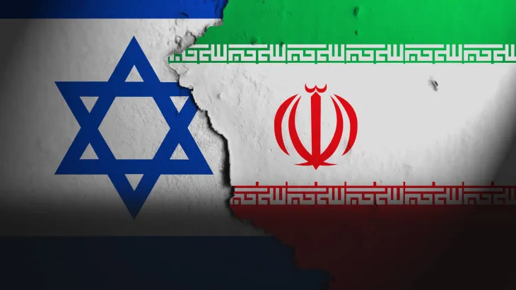

You'd think telling time between two countries would be simple math.

But in 2025, the time difference between Israel and Iran — two nations constantly in the news — is more complicated than you think. The gap isn't fixed. It's a moving target, all because of one country's recent decision and another's long-standing tradition.

This is a time zone story you won’t want to miss.

---

## 🇮🇷 Iran: Locked in Time

**Time Zone:** Iran Standard Time (IRST)
**UTC Offset:** `UTC+3:30`

Iran's time is unique for two reasons:
- 🕖 It uses a rare half-hour offset.
- 📆 In 2022, Iran **abolished Daylight Saving Time (DST)**.

> This means clocks in Iran stay the same all year. No "springing forward" or "falling back." Their time is constant.

---

## 🇮🇱 Israel: The Seasonal Shift

**Time Zone:** Israel Standard Time (IST) / Israel Daylight Time (IDT)
**UTC Offset:** `UTC+2` (Standard) / `UTC+3` (Daylight)

Unlike Iran, Israel follows Daylight Saving Time.
- ⏰ In the spring, clocks move forward 1 hour to `UTC+3`.
- ⏰ In the fall, they move back 1 hour to `UTC+2`.

> For anyone scheduling across this region, Israel's clock changes are a critical detail to track.

---

## 🤯 The Head-to-Head: A Fluctuating Gap

Because one nation's time is fixed and the other's changes, the difference between them flips twice a year.

- **During Israeli Winter (Standard Time):**
  - Israel is `UTC+2`. Iran is `UTC+3:30`.
  - **Difference:** Iran is **1.5 hours ahead**.

- **During Israeli Summer (Daylight Time):**
  - Israel is `UTC+3`. Iran is `UTC+3:30`.
  - **Difference:** Iran is only **30 minutes ahead**.

---

## 🌐 Why This Matters

This isn't just trivia — it has real-world consequences for:
- **News Reporting:** A 5 PM event in Tel Aviv could be 6:30 PM or 5:30 PM in Tehran depending on the season.
- **International Business:** Scheduling meetings requires knowing which "gap" is currently active.
- **Global Coordination:** Anyone working across these zones needs to be aware of the shift.

Need to check the current, exact difference right now?
Use [What's The Time](https://whatsthetime.online) for a real-time conversion that accounts for all these rules automatically.

---

## ✍️ Final Thoughts

Something as simple as "what's the time" can reveal hidden layers of national policy and history.

This shifting time gap is a powerful reminder that timekeeping isn’t just about numbers — it's about **context**.

For automatic conversions and to stay ahead of these changes, explore [What's The Time](https://whatsthetime.online).
It’s time, made simple.