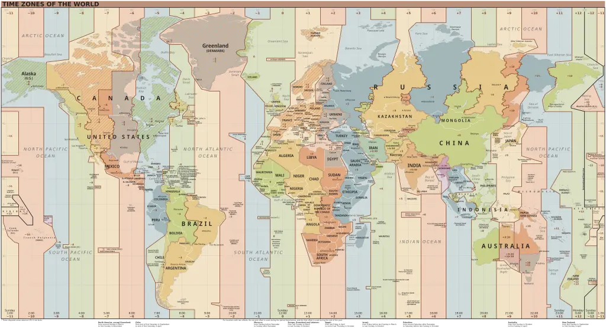
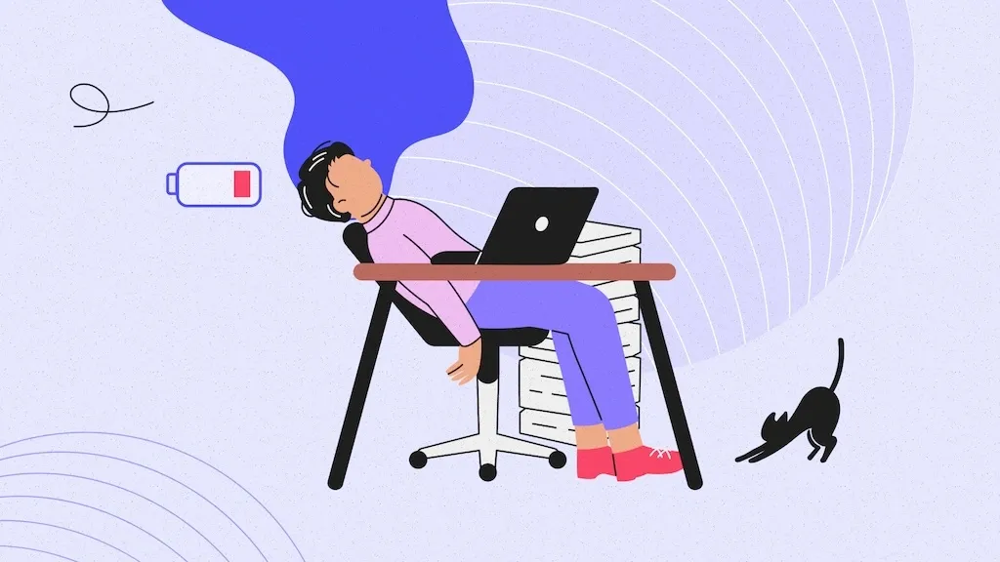

Hybrid work isn’t just a pandemic-era experiment anymore — it’s now the **global standard for team collaboration**. As of mid-2025, more than 70% of knowledge-based companies are officially hybrid-first or fully remote. While the freedom to work anywhere sounds ideal, it introduces one of the biggest productivity challenges of our time: **working across time zones**.

In this blog, we’ll explore how teams can master hybrid work schedules, plan meetings efficiently, use the latest tools, and thrive in this new era of distributed collaboration.

---

## What Is Hybrid Work in 2025?

Hybrid work refers to a flexible model where employees split their time between remote and on-site work. In 2025, this looks like:

- **Flexible days**: Employees choose which days to come to the office
- **Remote-first policies**: Meetings are optimized for remote participants
- **Global hiring**: Talent is hired based on skill, not geography

Many companies are now **remote-native** with only occasional physical meetups. This has opened opportunities for global hiring, diverse teams, and around-the-clock operations — but has also made time coordination **more complex than ever**.

---

## The Great Time Zone Challenge

Coordinating global teams is often like solving a Rubik’s cube with time. A manager in Berlin might start their day just as a developer in Manila signs off. Misaligned schedules lead to:

- **Missed meetings**
- **Delayed feedback cycles**
- **Meeting fatigue from early/late calls**

One of the key skills of successful hybrid teams today is **time zone awareness**. That’s why many are turning to tools like the [Global Meeting Planner](https://whatsthetime.online) — which helps identify the best meeting time for all participants.

---

<ins class="adsbygoogle"
     style="display:block; text-align:center;"
     data-ad-layout="in-article"
     data-ad-format="fluid"
     data-ad-client="ca-pub-6381695271630022"
     data-ad-slot="2167329849"></ins>

---

## How Smart Companies Are Adapting

Forward-thinking organizations are reimagining work with time in mind. Here’s how:

### 1. **Time Zone Transparency**
Great teams don’t hide time zones — they display them. Tools like Slack now show time zones next to names. Google Calendar auto-converts invite times for each user. And internal dashboards often include **real-time clocks** for key team hubs.

### 2. **Asynchronous First**
Async work is no longer a buzzword — it’s survival. Tools like Notion, Loom, Linear, and GitHub Issues allow work to move forward without meetings. Leaders now encourage recording videos instead of meetings, and writing detailed updates instead of Slack threads.

### 3. **Defined “Core Hours”**
Some teams establish 2–4 overlapping hours across time zones as their daily “core hours” — when everyone is online for calls, decisions, and collaboration. Outside those hours, async work thrives.

---

---

## Tools That Make Hybrid Work… Work

2025 has introduced a wave of tools that are powering the hybrid revolution:

- 🧠 **AI Meeting Schedulers** like Clockwise and Reclaim automatically schedule meetings with time zone, energy levels, and focus time in mind.
- 🕒 **World Clock dashboards** built into tools like Teams, Slack, and browser extensions help employees stay aware of distributed coworkers.
- 📆 **Smart calendar overlays** allow side-by-side views of everyone’s availability.

Don’t forget to explore free tools like [What’s The Time Converter](https://whatsthetime.online) to quickly compare any two cities or time zones in seconds.

---

## Managing Burnout in Distributed Teams

While hybrid work offers flexibility, it can also blur boundaries. Employees who wake up for 6 AM calls or stay late for clients in other continents face **chronic burnout**. This is especially common in Asia-Pacific teams working with U.S. or European counterparts.

To combat this:

- Enforce **no-meeting zones** outside of standard hours.
- Rotate meeting times to **share the inconvenience** fairly.
- Emphasize results over presence — let employees work when they’re most productive.

---

---

## The Rise of “TimeOps” Teams

A new trend in hybrid companies is the formation of **TimeOps** — small internal teams that monitor, optimize, and improve time use across the organization.

Their responsibilities include:

- Analyzing calendars for wasted time
- Suggesting optimal work hours by region
- Preventing time conflicts for launches or meetings
- Building internal documentation to encourage async

As work becomes more distributed, **TimeOps may become as essential as DevOps**.

---

<ins class="adsbygoogle"
     style="display:block; text-align:center;"
     data-ad-layout="in-article"
     data-ad-format="fluid"
     data-ad-client="ca-pub-6381695271630022"
     data-ad-slot="2167329849"></ins>

---

## Real Examples of Hybrid Success

Let’s take a look at how companies are doing it:

- **GitLab** has been fully remote since inception. They operate with a handbook-first model, async by default, and timezone diversity.
- **Spotify** allows employees to work from anywhere and structures teams to be timezone-compatible instead of office-based.
- **Zapier** rotates meeting times and celebrates async communication as their default culture.

These companies prove that with the right mindset, **location diversity becomes a strength**, not a weakness.

---

---

## Final Thoughts

Hybrid work isn’t the future — it’s the present. And time zones, once seen as barriers, can now be managed with tools, culture, and a little planning.

Your team’s ability to **respect, understand, and work around time differences** will define your success in this new era.

If you're building a team, leading meetings, or just trying to stay sane across time zones, make sure to try our [Global Meeting Planner](https://whatsthetime.online). It’s built for exactly this future.

Let’s master time, together.

