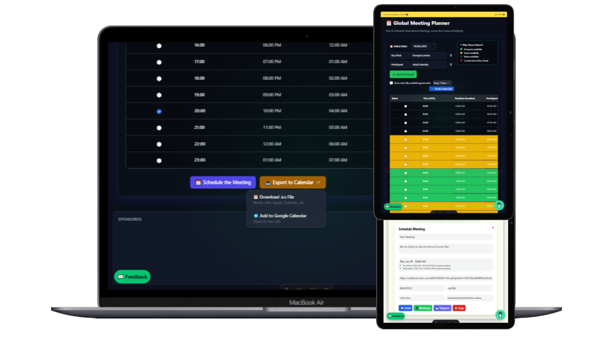

---

title: "Top 10 Meeting Planners for Scheduling Across Time Zones in 2025 🌍🕒"
description: "Discover the best tools to plan meetings across time zones. From AI-powered planners to simple scheduling polls, find your perfect fit. Featuring our own Global Meeting Planner by WhatsTheTime."
author: "WhatstheTime Blog Team"
pubDate: "2025-06-20"
image: "/blog/assets/mtools.webp"
tags: ["Meeting Planning", "Productivity", "Remote Work", "top", "scheduling", "scheduler", "meeting"]
----------------------------------------------------------------

Planning meetings across time zones can be a nightmare 🌐⏰ — until you find the right tool. In this guide, we compare **10 of the best meeting planners** that make global scheduling painless. Whether you're a remote team, digital nomad, or event organizer, these tools help you align across continents.

## 1. 🌟 Global Meeting Planner @WhatstheTime

**Meetings that match everyone’s sleep and work hours.**

The <a href="../../meeting-planner" target="_blank" rel="noopener noreferrer">Global Meeting Planner by WhatsTheTime</a> is built to make timezone chaos a thing of the past. With a stunning glassmorphic UI, real-time slot suggestions, and intelligent availability highlighting — it's a modern alternative to the boring spreadsheet method.

### 🌐 Key Features

* Live, color-coded time slot grid with availability
* Auto-detect participant zones (with alias support)
* iCal + Google Calendar exports
* Shareable links, popups, emoji labels (sleep/work/weekend)
* Designed for **elegance + usability**

### ✅ Pros

* Sleek UI, mobile-friendly
* Easy to use for groups, no sign-in required
* Time zone conversion, notes, and copy/share built-in

### ❌ Cons

* Newer tool; still expanding feature set
* No recurring meetings (yet)

### ⚡ Try it Live :)
<iframe src='https://whatsthetime.online/metEmbed' width='100%' height='600' style='border:none;' loading='lazy'></iframe>

---

## 2. Calendly

**The classic scheduling tool for professionals.**

Calendly is a well-known and widely adopted tool to schedule meetings, especially for 1-on-1s and sales demos.

### ✅ Pros

* Auto timezone adjustment
* Zoom/Meet integrations
* Great calendar sync + availability management

### ❌ Cons

* Free plan is limited
* Pricing grows fast for teams

---

## 3. Doodle

**Poll-based scheduler for groups.**

Doodle lets invitees vote on time slots. Works well for community events or cross-timezone groups with no fixed calendar.

### ✅ Pros

* Poll style, timezone auto-adjusted
* Easy for invitees

### ❌ Cons

* Requires organizer action after votes
* No calendar sync

---

## 4. Zencal

**Aesthetic and minimalist Calendly alternative.**

Zencal is growing in popularity thanks to its clean design and useful integrations.

### ✅ Pros

* Payment support
* Custom branding
* Clean interface

### ❌ Cons

* Limited on free plan
* Fewer integrations than Calendly

---

## 5. World Time Buddy

**Time zone comparison tool, not a booking system.**

WTB offers an intuitive drag-and-compare grid to find overlaps.

### ✅ Pros

* Clear timezone grid
* Fast and responsive

### ❌ Cons

* No calendar booking or sharing
* Not ideal for large group planning

---

## 6. Google Calendar Appointment Slots

**Built-in option for Google Workspace users.**

Appointment slots in Google Calendar support timezone syncing and simple availability.

### ✅ Pros

* No extra tools if you're in Google Workspace
* Integrates Meet

### ❌ Cons

* No public page or availability grid
* Lacks slot suggestions or polls

---

## 7. OnceHub (ScheduleOnce)

**Robust scheduler for sales and customer teams.**

ScheduleOnce is a powerful enterprise tool for structured bookings.

### ✅ Pros

* Team routing
* Powerful rules engine

### ❌ Cons

* Complex to set up
* UI is dated

---

## 8. Reclaim.ai

**AI calendar co-pilot for busy professionals.**

Automatically blocks time for focus, breaks, meetings — based on behavior.

### ✅ Pros

* Smart scheduling
* Adjusts dynamically

### ❌ Cons

* Not for external bookings
* Somewhat confusing for non-tech users

---

## 9. Clockwise

**Optimize team calendars to reduce fragmentation.**

Clockwise auto-moves events to create focus time.

### ✅ Pros

* Ideal for internal teams
* Works with Slack and Google

### ❌ Cons

* No direct scheduling link
* Focused on internal productivity

---

## 10. Rallly

**Open-source poll-based scheduler.**

Free, privacy-friendly, and collaborative — great for small groups.

### ✅ Pros

* Fully free
* Community-driven

### ❌ Cons

* No integration or export features
* Basic UI/UX

---

## 🔚 Final Thoughts

Each planner has its niche — but if you're looking for something **visually modern, powerful, and truly made for 2025 remote teams**, our **Global Meeting Planner** is the ultimate choice.

<iframe src='https://whatsthetime.online/metEmbed' width='100%' height='400' style='border:none;' loading='lazy'></iframe>

✅ Try it live, free, and beautifully embedded above.

---

*This post is accurate as of June 2025. Let us know if you'd like to see comparison tables or interactive previews next!*
