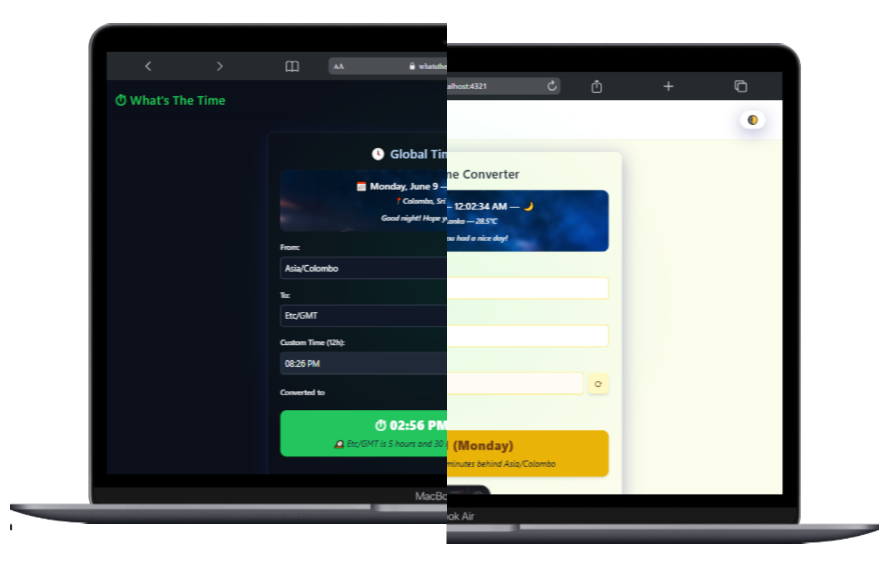
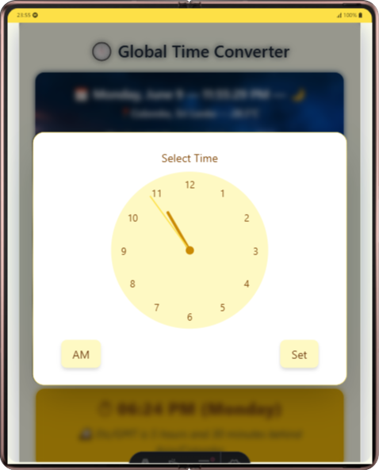
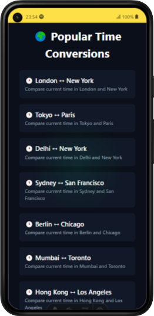
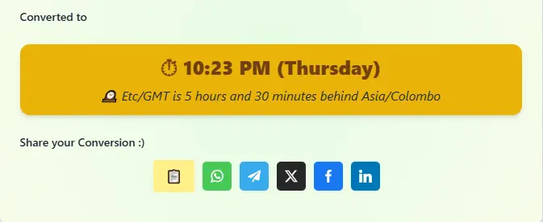

In our increasingly connected world, coordinating across time zones has become a daily necessity. Whether you're scheduling international meetings, planning travel, or staying in touch with friends and family around the globe, having a reliable time zone converter is essential. Enter **What's The Time Online** – a revolutionary time conversion tool that combines stunning design with powerful functionality to make time zone conversion effortless and intuitive.

## Why What's The Time Online Stands Out


What's The Time Online isn't just another time zone converter – it's a complete reimagining of how time conversion tools should work. Built with modern web technologies and powered by Astro for blazing-fast performance, this tool delivers an experience that's both beautiful and functional.

### 🎨 Most Elegant UI/UX in Time Tools

The first thing you'll notice about [What's The Time Online](https://whatsthetime.online){target="_blank"} is its stunning visual design. Unlike cluttered traditional time converters, this tool embraces minimalism and clarity. The interface is clean, modern, and focused entirely on what matters most – giving you accurate time conversions quickly and beautifully.



The design philosophy centers on eliminating visual noise while enhancing usability. Every element serves a purpose, creating an interface that's both aesthetically pleasing and incredibly functional.

### ⏰ Analog Clock Picker



One of the most innovative features is the analog clock-style picker. Instead of scrolling through endless dropdown menus or typing numbers, you can visually pick your time just like you would on a real clock. This intuitive approach makes time selection smooth, natural, and surprisingly satisfying.

The analog interface bridges the gap between digital efficiency and analog familiarity, making it accessible to users of all ages and technical backgrounds.

### 🌍 Intelligent Zone Detection

What's The Time Online automatically detects your current time zone without requiring any input from you. This smart detection system uses your IP location to instantly configure the tool for your local time, eliminating the need for manual setup.

The searchable zone input system makes finding any time zone effortless. Simply start typing a city name, and the intelligent search will quickly locate the correct time zone for you.

### 📱 Mobile-First Design



In today's mobile-first world, What's The Time Online shines on smartphones and tablets. The responsive design ensures that all features work flawlessly across devices, giving you access to global time information wherever you are.

The touch-friendly interface makes using the analog clock picker on mobile devices feel natural and responsive, proving that mobile time conversion doesn't have to compromise on functionality or elegance.

### ⚡ Lightning-Fast Performance

Built with Astro, What's The Time Online is optimized for speed. The tool loads instantly and provides real-time conversions without any lag. Pre-rendered pages and optimized assets ensure that you get the information you need as quickly as possible.

This performance advantage means you can rely on the tool for quick time checks during busy workdays or when you need instant conversions on the go.

### 🔗 Embed Anywhere

One of the most powerful features is the ability to embed the time converter directly into your own websites, blogs, or applications. With a simple iframe snippet, you can give your audience instant access to time conversion functionality:

```html
<iframe
  src="https://whatsthetime.online/embed"
  width="100%"
  height="100%"
  style="border:none;"
  loading="lazy">
</iframe>
```

This makes it perfect for:
- Travel blogs and websites
- Business websites with international clients
- Event planning platforms
- Educational resources
- Any site that needs time zone functionality

### 🌟 Popular Time Zone Conversions


The tool includes quick access to the most commonly requested time zone conversions, including:

- London ↔ New York
- Tokyo ↔ Paris
- Delhi ↔ New York
- Sydney ↔ San Francisco
- Berlin ↔ Chicago
- Mumbai ↔ Toronto
- Hong Kong ↔ Los Angeles

These [popular conversions](https://whatsthetime.online/popular){target="_blank"} save you time by providing instant access to frequently needed time zone relationships.

### 🎯 Contextual Information

What's The Time Online goes beyond simple time conversion by providing contextual information that makes the data more meaningful:

- **Emoji indicators** that reflect the time of day
- **Context-aware styling** that changes based on local conditions
- **Time-based visual cues** that help you understand what part of the day it is elsewhere
- **Real-time updates** that keep information current

### 🔒 Privacy-Focused

Your privacy matters. What's The Time Online doesn't store personal data – zone detection is purely local and IP-based. The tool is designed to provide maximum functionality while maintaining your privacy and security.

### 📡 Shareable conversion 
links for easy collaboration


### 💡 Coming Soon: Enhanced Features

The development team is constantly working on new features to make What's The Time Online even more powerful:

- **AI-based time zone suggestions** for smarter recommendations
- **Travel information integration** for comprehensive planning
- **Advanced scheduling features** for meeting coordination

## Perfect for Every Use Case

### Business Professionals
Schedule international meetings with confidence, knowing exactly when your colleagues will be available in their local time zones.

### Travelers
Plan your trips with accurate time information and weather context for your destinations.

### Remote Workers
Stay synchronized with distributed teams across multiple time zones.

### Students and Educators
Learn about global time zones with an interactive, visual approach.

### Event Planners
Coordinate global events with precise time zone management.

## Free and Accessible

What's The Time Online is completely free to use, with only ethical sponsorships to support development. There are no hidden fees, no account requirements, and no data collection – just pure, accessible time conversion functionality.

## Get Started Today

Ready to experience the future of time zone conversion? Visit [What's The Time Online](https://whatsthetime.online){target="_blank"} and discover how easy and elegant time conversion can be.

The tool works instantly in any modern browser – no installation required. Whether you're on desktop, tablet, or mobile, you'll have access to the most beautiful and functional time zone converter on the web.

Try it now and see why What's The Time Online is quickly becoming the go-to choice for anyone who needs accurate, beautiful, and fast time zone conversions.

---

*What's The Time Online – Where elegant design meets powerful functionality for the ultimate time zone conversion experience.*